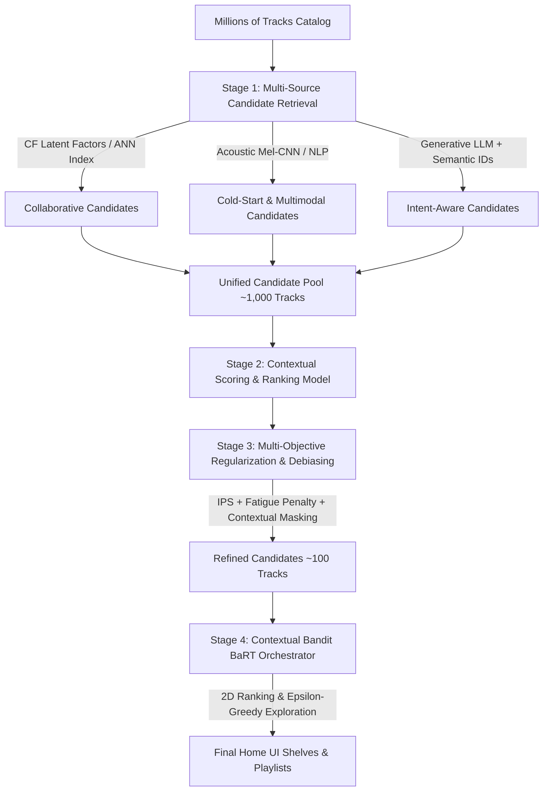
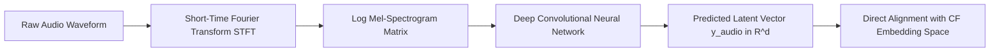
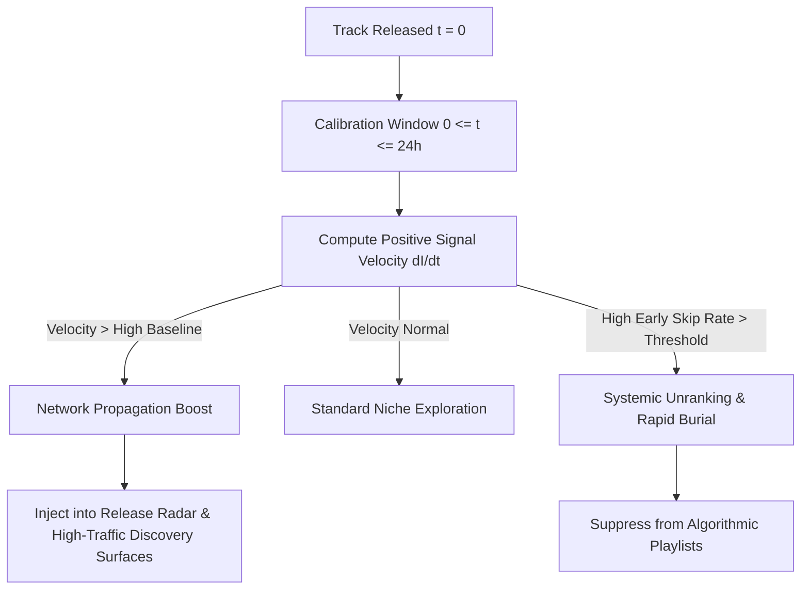

# Algorithmic Specification: Music Recommendation, Retrieval, and Ranking Engine

This document formalizes the complete algorithmic framework, mathematical foundations, candidate generation pipelines, reinforcement learning policies, and ranking/unranking theses governing the hyperscale audio streaming platform.

---

## Table of Contents
1. [Algorithmic Architecture Overview](#1-algorithmic-architecture-overview)
2. [Candidate Generation & Embedding Pipelines](#2-candidate-generation--embedding-pipelines)
   - 2.1 [Implicit Collaborative Filtering (ALS Formulation)](#21-implicit-collaborative-filtering-als-formulation)
   - 2.2 [Approximate Nearest Neighbor (ANN) Retrieval](#22-approximate-nearest-neighbor-ann-retrieval)
   - 2.3 [Acoustic Cold-Start & Deep Mel-Spectrogram CNN](#23-acoustic-cold-start--deep-mel-spectrogram-cnn)
   - 2.4 [Cultural NLP & Multimodal Item Fusion](#24-cultural-nlp--multimodal-item-fusion)
   - 2.5 [Generative LLM Retrieval & Semantic IDs](#25-generative-llm-retrieval--semantic-ids)
3. [Contextual Multi-Armed Bandits (BaRT Orchestrator)](#3-contextual-multi-armed-bandits-bart-orchestrator)
   - 3.1 [Problem Formulation & 2D Interface Slotting](#31-problem-formulation--2d-interface-slotting)
   - 3.2 [Exploration vs. Exploitation ($\epsilon$-Greedy Policy)](#32-exploration-vs-exploitation-epsilon-greedy-policy)
   - 3.3 [Multi-Objective Scalarization via Generalized Gini Index (GGI)](#33-multi-objective-scalarization-via-generalized-gini-index-ggi)
4. [The Five Core Algorithmic Theses](#4-the-five-core-algorithmic-theses)
   - [Thesis 1: Binarized Time Threshold (30-Second Utility Proxy)](#thesis-1-binarized-time-threshold-30-second-utility-proxy)
   - [Thesis 2: Implicit Action Hierarchies & Matrix Dynamics](#thesis-2-implicit-action-hierarchies--matrix-dynamics)
   - [Thesis 3: Contextual Co-Clustering & Localized Unranking](#thesis-3-contextual-co-clustering--localized-unranking)
   - [Thesis 4: Degenerate Feedback Loop Mitigation & Regularization](#thesis-4-degenerate-feedback-loop-mitigation--regularization)
   - [Thesis 5: Early Lifecycle Velocity & Dynamic Network Propagation](#thesis-5-early-lifecycle-velocity--dynamic-network-propagation)
5. [End-to-End Algorithmic Execution Pipeline](#5-end-to-end-algorithmic-execution-pipeline)

---

## 1. Algorithmic Architecture Overview

The recommendation system operates as a multi-stage funnel designed to reduce a multi-million track catalog down to a ranked, diversified set of recommendations served within a sub-100ms latency budget.



---

## 2. Candidate Generation & Embedding Pipelines

### 2.1 Implicit Collaborative Filtering (ALS Formulation)

Because users interact via implicit signals rather than explicit ratings, interactions are transformed into a binary preference $p_{ui}$ coupled with a confidence weight $c_{ui}$.

#### Mathematical Formulation
For user $u$ and track $i$, given interaction observation $r_{ui}$ (e.g., streaming count, completion weighted frequency):

$$p_{ui} = \begin{cases} 1 & \text{if } r_{ui} > 0 \\ 0 & \text{if } r_{ui} = 0 \end{cases}$$

$$c_{ui} = 1 + \alpha \cdot f(r_{ui})$$

Where $\alpha$ is a confidence hyperparameter and $f(r_{ui})$ represents the friction-weighted interaction aggregate.

The optimization objective minimizes the penalized weighted squared error over low-dimensional user vectors $x_u \in \mathbb{R}^d$ and item vectors $y_i \in \mathbb{R}^d$:

$$\min_{x_*, y_*} \sum_{u, i} c_{ui} \left( p_{ui} - x_u^T y_i \right)^2 + \lambda \left( \sum_u \|x_u\|_2^2 + \sum_i \|y_i\|_2^2 \right)$$

This is solved at scale using Spark MLlib's distributed Alternating Least Squares (ALS) solver.

---

### 2.2 Approximate Nearest Neighbor (ANN) Retrieval

To retrieve the top-$K$ candidate tracks for user vector $x_u$ in sub-linear time:

$$\text{Candidates}(u) = \arg\max_{i \in \mathcal{I}}^{(K)} \left( x_u^T y_i \right)$$

#### Index Structures
1. **Annoy (Random Projection Trees)**:
   - Recursively partitions $\mathbb{R}^d$ space using random hyperplanes until leaf nodes contain at most a predefined threshold of items.
   - Deployed using memory-mapped files (`mmap`), allowing multiple worker processes to share static vector indices with zero memory bloat.
2. **HNSW (Hierarchical Navigable Small World)**:
   - Constructs a multi-layer graph where lower layers contain fine-grained connections and upper layers contain long-range links.
   - Provides logarithmic search complexity $\mathcal{O}(\log N)$ with higher recall for dynamic catalog ingestion.

---

### 2.3 Acoustic Cold-Start & Deep Mel-Spectrogram CNN

When a newly released track $i_{\text{new}}$ has no interaction history ($r_{u, i_{\text{new}}} = \emptyset$), the system infers its latent embedding directly from raw audio.



#### Acoustic Transformation
1. Audio waveform $s(t)$ is sampled and converted via Short-Time Fourier Transform (STFT) into a Mel-scaled spectrogram:
   $$M(f, t) = \text{MelFilterBank}\left( |\text{STFT}(s(t))|^2 \right)$$
2. A CNN model $\phi_{\text{audio}}$ maps $M(f, t)$ to latent representation $\hat{y}_i$:
   $$\hat{y}_i = \phi_{\text{audio}}(M) \in \mathbb{R}^d$$
3. Loss function during offline training aligns the audio CNN projection with existing ALS collaborative filtering embeddings $y_i$:
   $$\mathcal{L}_{\text{cold-start}} = \frac{1}{|\mathcal{I}_{\text{train}}|} \sum_{i \in \mathcal{I}_{\text{train}}} \|\phi_{\text{audio}}(M_i) - y_i\|_2^2$$

---

### 2.4 Cultural NLP & Multimodal Item Fusion

Unstructured web data (blogs, album reviews, artist bios) is scraped and processed via a Transformer encoder $\psi_{\text{nlp}}$ to capture cultural tags and contextual vibes:

$$e_{i}^{\text{nlp}} = \psi_{\text{nlp}}(\text{Text}_i) \in \mathbb{R}^k$$

#### Unified Multimodal Embedding
The comprehensive item embedding vector $e_i$ is constructed via a learned projection layer $W_{\text{proj}}$:

$$e_i = W_{\text{proj}} \left[ y_i^{\text{CF}} \,\|\, \hat{y}_i^{\text{audio}} \,\|\, e_i^{\text{nlp}} \right]$$

---

### 2.5 Generative LLM Retrieval & Semantic IDs

For real-time intent-aware discovery (e.g., GLIDE/PLUM frameworks):

1. **Semantic ID Quantization**:
   Continuous CF item vectors $y_i$ are discretized using Residual Vector Quantization (RVQ) into hierarchical tokens:
   $$y_i \xrightarrow{\text{RVQ}} \langle t_1^i, t_2^i, \dots, t_m^i \rangle \in \mathcal{V}^m$$
   This enables the LLM to treat catalog tracks directly as native vocabulary tokens without text hallucination.

2. **Soft Prompting with Generalized User Representation (GUR)**:
   An autoencoder compresses user historical sequences and session context into dense prefix tokens:
   $$\text{Prefix}_u = \text{Encoder}_{\text{GUR}}(\text{History}_u, \text{Context}_t)$$
   $$\text{Prompt} = \left[ \text{Prefix}_u \,\|\, \text{Session Intent Query} \right]$$

3. **Stochastic Primal-Dual Decoding (SPDD)**:
   Replaces slow Beam Search with SPDD to sample Semantic ID token sequences that maximize both relevance probability and diversity constraints under fixed latency budgets.

---

## 3. Contextual Multi-Armed Bandits (BaRT Orchestrator)

The application home screen is governed by the **BaRT (Bandits for Recommendations as Treatments)** framework, which frames content slotting as a contextual reinforcement learning task.

### 3.1 Problem Formulation & 2D Interface Slotting
At each request time $t$, the system observes user context vector $x_{u, c} \in \mathcal{X}$ (user historical features, device type, time of day, active network) and must select an action $a \in \mathcal{A}$:

- **Horizontal Action $a_{\text{horiz}}$**: Track/album ordering within shelf $s$.
- **Vertical Action $a_{\text{vert}}$**: Shelf priority order on the home view.

### 3.2 Exploration vs. Exploitation ($\epsilon$-Greedy Policy)

$$\pi(a \mid x_{u, c}) = \begin{cases} \arg\max_{a \in \mathcal{A}} \hat{Q}(x_{u, c}, a) & \text{with probability } 1 - \epsilon \\ \text{Sample uniformly from } \mathcal{A}_{\text{explore}} & \text{with probability } \epsilon \end{cases}$$

- **Exploitation**: Selects content with the highest expected stream completion and save probability.
- **Exploration ($\epsilon$)**: Surfaces novel, low-sample-size content to gather unbiased feedback and discover evolving tastes.

### 3.3 Multi-Objective Scalarization via Generalized Gini Index (GGI)

The reward function must balance competing stakeholder objectives: user engagement vs. artist catalog exposure fairness.

$$\text{Reward}(u, a) = GGI\left( R_{\text{user}}(u, a), D_{\text{catalog}}(a) \right)$$

$$GGI(\mathbf{w}, \mathbf{r}) = \sum_{k=1}^K w_k \cdot r_{(k)} \quad \text{where } r_{(1)} \le r_{(2)} \le \dots \le r_{(K)}$$

By ordering rewards and applying rank-dependent weights $w_k$, the bandit prevents over-concentration on top-tier viral tracks and maintains broad catalog vitality.

---

## 4. The Five Core Algorithmic Theses

### Thesis 1: Binarized Time Threshold (30-Second Utility Proxy)

Raw play counts are vulnerable to clickbait and UI positioning artifacts. The fundamental proxy for positive user utility is explicitly consumption depth.

```
       [Play Initiated]
              |
              v
        [0 to 29.9s] ------------ Skip Triggered ------------> Reward r = 0 (Failure / Skip Penalty)
              |
         (>= 30.0s)
              |
              v
    [30s Threshold Reached] ----------------------------------> Reward r = 1 (Successful Stream)
              |
              v
    [Full Track Completion / Save] ---------------------------> High-Value Reinforcement
```

#### Mathematical Formulation

$$R_{\text{stream}}(u, i, t_{\text{duration}}) = \begin{cases} +1.0 & \text{if } t_{\text{duration}} \ge 30\text{ seconds} \\ -\gamma_{\text{skip}} & \text{if } t_{\text{duration}} < 30\text{ seconds (active user skip)} \end{cases}$$

#### Optimization Target
The ranking models directly maximize **Completion Rate (CR)** and **Save Rate (SR)**:

$$\text{CR}(i) = \frac{\sum_{j=1}^{N_i} \mathbb{I}(t_{\text{duration}}^{(j)} \ge \text{TrackLength}_i)}{N_i}, \quad \text{SR}(i) = \frac{\sum_{j=1}^{N_i} \mathbb{I}(\text{Saved}_i^{(j)} = 1)}{N_i}$$

---

### Thesis 2: Implicit Action Hierarchies & Matrix Dynamics

The platform establishes a strict hierarchy of implicit interactions weighted by the **physical and cognitive friction** required by the user to execute the action.

| Interaction Type | User Friction Level | Multiplier / Weight ($w_k$) | Matrix Effect |
| :--- | :--- | :--- | :--- |
| **Manual Playlist Add** | High (Multi-step UI interaction) | $+5.0$ | Strong vector attraction |
| **External Social Share** | High (App transition) | $+4.5$ | Broad cohort propagation |
| **Repeat Listen ($\ge 2\times$)**| Medium-High (Intentional recall) | $+3.0$ | Core affinity reinforcement |
| **Library / Favorite Save** | Medium (Single tap action) | $+2.5$ | Latent alignment boost |
| **Passive 30s+ Stream** | Low (Zero interaction) | $+1.0$ | Baseline reinforcement |
| **Passive Track Completion**| Low (Continuous listening) | $+1.2$ | Positive drift |
| **Active Early Skip ($<30$s)**| Medium (Manual skip trigger) | $-2.0$ | Aggressive negative decay |
| **Contextual Block / Hide** | High (Menu interaction) | $-6.0$ | Hard unranking exclusion |

#### Composite Interaction Score

$$S(u, i) = \sum_{k \in \text{Actions}} w_k \cdot N_{u, i, k} \cdot \exp\left(-\lambda_{\text{time}} (t_{\text{now}} - t_k)\right)$$

Where $\exp(-\lambda_{\text{time}} \Delta t)$ represents temporal decay on older interactions.

---

### Thesis 3: Contextual Co-Clustering & Localized Unranking

Audio utility is not a global scalar; it exists solely as a function of the triad: **User Segment $\times$ Playback Context $\times$ Item Vector**.

$$\hat{Y}(u, i, c) = g\left( x_u, y_i, z_c \right)$$

Where $z_c$ is the dynamic context vector encompassing:
- **Temporal**: Time of day, day of week, seasonal period.
- **Hardware**: Mobile earbuds, car infotainment, living room smart speaker, desktop workstation.
- **Activity Context**: "Deep Focus", "High-Intensity Workout", "Sleep / Ambient", "Commute".

#### Localized Unranking Rule
If track $i$ exhibits a high skip rate in Context $A$ ($\text{SkipRate}_{i, c_A} > 0.75$), the system suppresses track $i$ **strictly within Context $A$**:

$$\text{RankScore}(i \mid u, c_A) \leftarrow 0 \quad \text{while} \quad \text{RankScore}(i \mid u, c_B) \text{ remains unaffected.}$$

---

### Thesis 4: Degenerate Feedback Loop Mitigation & Regularization

Recommenders trained purely on self-logged data amplify exposure bias and create algorithmic filter bubbles. Two explicit debiasing algorithms are enforced:

#### 1. Inverse Propensity Scoring (IPS) for Position Bias Correction
To prevent top-ranked slots from dominating training signals:

$$\mathcal{L}_{\text{IPS}}(\theta) = \sum_{(u, i) \in \mathcal{D}} \frac{\ell\left( y_{ui}, f_\theta(x_u, y_i) \right)}{P(\text{Surfaced}_{ui} \mid \text{Position } k, \text{Context } c)}$$

Where $P(\text{Surfaced}_{ui} \mid k, c)$ is the empirically measured propensity of a user observing an item at rank position $k$.

#### 2. Finite Pool Saturation & Exponential Fatigue Decay
If track $i$ is presented to user $u$ repeatedly without triggering a high-value interaction (Save, Playlist Add), its ranking score decays exponentially:

$$\text{Score}_{\text{final}}(u, i) = \text{Score}_{\text{base}}(u, i) \times \exp\left(-\beta_{\text{fatigue}} \cdot \text{UnsavedImpressions}(u, i)\right)$$

Once $\text{UnsavedImpressions}(u, i) \ge K_{\text{max}}$, track $i$ is forcefully **unranked** for user $u$ for a cool-down window of $N$ days.

---

### Thesis 5: Early Lifecycle Velocity & Dynamic Network Propagation

Newly released content undergoes a critical **12–24 Hour Calibration Window** to determine network-wide propagation viability.



#### Velocity Metric Calculation

$$v_{\text{early}}(i) = \left. \frac{d I_{\text{pos}}(i, t)}{dt} \right|_{t \in [0, 24\text{h}]} = \frac{\Delta \text{PreSaves}(i) + w_1 \Delta \text{Day1Streams}_{30\text{s}+}(i) + w_2 \Delta \text{PlaylistAdds}(i)}{\Delta t}$$

#### Lifecycle Propagation Logic

$$\text{Action}(i) = \begin{cases} \text{Promote to Broad Exploration (Boost Ranking } \times 1.8) & \text{if } v_{\text{early}}(i) > \tau_{\text{high}} \text{ and } \text{SkipRate} < 0.25 \\ \text{Maintain Localized Cluster Exploration} & \text{if } \tau_{\text{low}} \le v_{\text{early}}(i) \le \tau_{\text{high}} \\ \text{Systemic Unranking (Drop from Algorithmic Queues)} & \text{if } \text{SkipRate}_{24\text{h}} > \theta_{\text{kill}} \end{cases}$$

---

## 5. End-to-End Algorithmic Execution Pipeline

```
ALGORITHM: GeneratePersonalizedRankedFeed(User u, Context c, Catalog C)
--------------------------------------------------------------------------------
1. FETCH user latent vector x_u and real-time session features from Online Feature Store.
2. CANDIDATE RETRIEVAL:
   a. C_cf   <- ANN_Search(Index_HNSW, x_u, K=500)
   b. C_cold <- Content_MelCNN_Search(x_u, K=100)
   c. C_llm  <- SPDD_Decode(LLM_GLIDE, Prefix=GUR(u, c), K=100)
   d. Pool C_raw <- Deduplicate(C_cf U C_cold U C_llm) (~700 tracks)

3. CONTEXTUAL FILTERING & LOCALIZED UNRANKING:
   FOR each item i in C_raw:
       IF HistoricalSkipRate(i, Context=c) > 0.75 THEN:
           REMOVE i from C_raw (Thesis 3: Localized Context Unranking)
       END IF
   END FOR

4. SCORING & PROBABILITY ESTIMATION:
   FOR each item i in C_raw:
       P_stream[i] <- PredictCompletionProbability(x_u, y_i, z_c)
       P_save[i]   <- PredictSaveProbability(x_u, y_i, z_c)
       BaseScore[i] <- (w_stream * P_stream[i]) + (w_save * P_save[i])
       
       // Apply Fatigue Regularization (Thesis 4)
       Fatigue[i] <- exp(-beta * UnsavedImpressions(u, i))
       
       // Apply Early Lifecycle Velocity Boost (Thesis 5)
       VelocityBoost[i] <- (Age(i) <= 24h AND Velocity(i) > tau) ? 1.8 : 1.0
       
       FinalScore[i] <- BaseScore[i] * Fatigue[i] * VelocityBoost[i]
   END FOR

5. BANDIT SELECTION & MULTI-OBJECTIVE RANKING (BaRT + GGI):
   a. Draw random variable r ~ Uniform(0, 1)
   b. IF r < epsilon:
          RankedFeed <- SampleExploratoryCandidates(C_raw, Strategy=GGI_Fairness)
      ELSE:
          RankedFeed <- SortDescending(C_raw, by=FinalScore)
      END IF

6. 2D UI MAPPING:
   a. Group RankedFeed into shelves: "Jump Back In", "Discover Weekly", "Release Radar"
   b. Apply horizontal sort within shelves and vertical shelf ordering.
7. RETURN RankedFeed (Latency <= 100ms)
--------------------------------------------------------------------------------
```
